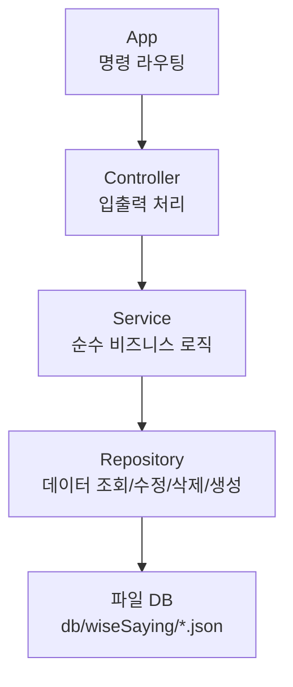

# 명언 게시판 (Kotlin, by TDD)

콘솔 기반 명언 CRUD 앱. [몰입코딩 - 코틀린 by TDD](https://www.slog.gg/p/14130) 커리큘럼(14단계, 37강)을 따라 처음부터 끝까지 완주했습니다.

## 기술 스택

- Kotlin 2.1.10
- Gradle 8.10 (Wrapper)
- JDK 21
- JUnit 5 + AssertJ 3.27.3

## 실행 방법

```
./gradlew.bat build   # 빌드 + 테스트
```

IntelliJ에서 `Main.kt`의 `fun main()`을 실행하면 콘솔 앱이 시작됩니다.

## 명령어

| 명령 | 설명 |
|---|---|
| `등록` | 명언/작가 입력받아 등록 |
| `목록`, `목록?page=N` | 목록 조회 (5개씩 페이징, 최신순) |
| `목록?keywordType=content&keyword=검색어` | 내용/작가 검색 |
| `삭제?id=N` | 명언 삭제 |
| `수정?id=N` | 명언 수정 |
| `빌드` | 전체 명언을 `data.json`으로 출력 |
| `종료` | 프로그램 종료 |

## 아키텍처



| 파일 | 역할 |
|---|---|
| `Main.kt` | 진입점 |
| `App.kt` | 명령어 입력받아 라우팅 |
| `WiseSayingController.kt` | 입출력, 응답 표현 |
| `WiseSayingService.kt` | 순수 비즈니스 로직 (입출력 없음) |
| `WiseSayingRepository.kt` | 데이터 조회/수정/삭제/생성, 파일 I/O (입출력 없음) |
| `WiseSaying.kt` | 명언 엔티티 + JSON 직렬화 확장 함수 |
| `Rq.kt` | 명령어 파싱 (`동작?파라미터=값`) |
| `Page.kt` | 페이징 결과를 담는 제네릭 DTO |

## 학습 기록

각 단계에서 나온 질문과 트러블슈팅은 [`docs/learning-log/`](./docs/learning-log)에 단계별로 기록되어 있습니다.
