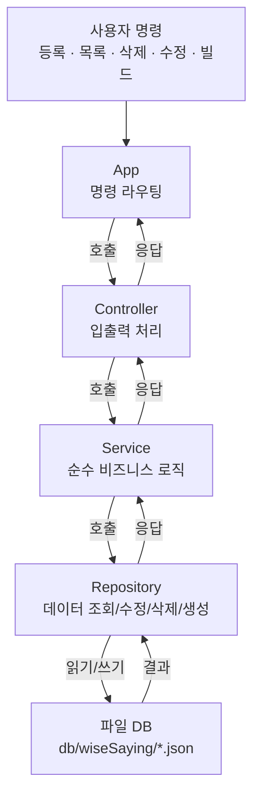

# 11단계 — Controller / Service / Repository 구조 도입

- 관련 강의: 15강 ~ 26강 (구조 리팩터링 파트)
- 상태: 완료
- 시작일: 2026-07-16
- 완료일: 2026-07-16

## 요구사항 요약

스프링부트의 일반적인 계층 구조를 참고해 `main()` 하나에 몰려있던 로직을 역할별로 분리한다.

- 요청 처리 흐름: **App(입력) → Controller(응답 표현) → Service(순수 비즈니스 로직) → Repository(데이터 조회/수정/삭제/생성) → 파일DB**
- `App`, `Controller`: 스캐너/출력 사용 가능
- `Service`, `Repository`: 스캐너 사용 금지, 출력 금지
- `WiseSaying`: 명언 객체, 모든 계층에서 사용 가능

## 아키텍처 다이어그램

`Service`와 `Repository`는 스캐너/출력이 금지되므로, 사용자와의 실제 대화는 오직 `Controller`에서만 일어난다. 각 계층은 자기 아래 계층을 호출하고 반환값을 받아 위로 넘길 뿐이다.

## 질문 로그

---
