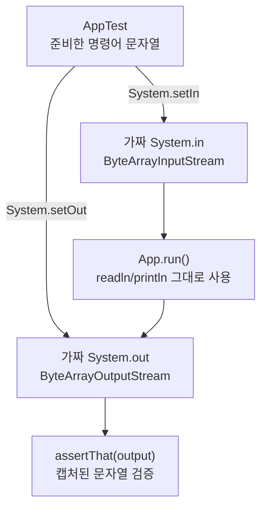

# 12단계 — TDD 적용 (JUnit)

- 관련 강의: 20강 ~ 26강 (테스트 파트)
- 상태: 완료
- 시작일: 2026-07-16
- 완료일: 2026-07-16

## 요구사항 요약

JUnit을 사용해 테스트를 작성한다. 표준입출력 리다이렉팅을 학습한 뒤 진행. 통합 테스트만 진행(단위 테스트는 생략) — 즉 각 명령어(등록/목록/삭제/수정/빌드)별로 통합 테스트를 작성한다.

## 아키텍처 다이어그램 (해당 시)

`App` 코드는 테스트용으로 전혀 수정하지 않는다. `System.in`/`System.out` 자체를 실행 전에 가짜 스트림으로 바꿔치기해서, `readln()`/`println()`이 실제 콘솔 대신 이 가짜 스트림을 상대하게 만드는 것이 핵심.

## 질문 로그

### 질문1
**Q.** `setUp()`과 `run()` 헬퍼 함수가 구체적으로 어떻게 동작하는가?

**A.** `setUp()`(`@BeforeEach`)은 매 `@Test` 실행 전마다 `db/wiseSaying`과 `data.json`을 삭제해 lastId 등 이전 테스트의 잔여 상태가 다음 테스트에 영향 주지 않게 함(테스트 순서는 보장되지 않으므로 필수). `run()`은 `System.in`/`System.out`을 백업 → `ByteArrayInputStream`/`ByteArrayOutputStream`으로 교체(`System.setIn`/`setOut`) → `App().run()` 실행(App은 readln/println을 평소처럼 호출할 뿐 바뀐 걸 모름) → 원래 스트림으로 복구 → 캡처된 출력을 문자열로 반환. `System.in`/`out`은 JVM 전역 값이라 한 번 바꾸면 프로그램 어디서든 영향받고, 그래서 테스트 후 반드시 원상복구해야 함.

---
