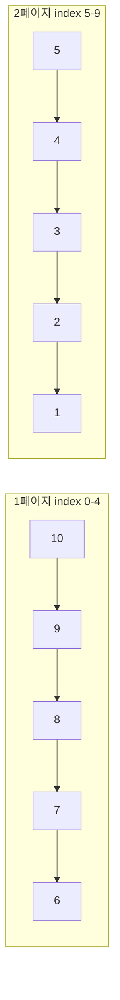

# 14단계 — 페이징 (마지막 단계)

- 관련 강의: 36강 ~ 37강
- 상태: 완료
- 시작일: 2026-07-16
- 완료일: 2026-07-16

## 요구사항 요약

`목록` 명령이 전체를 다 보여주지 않고 페이징된다.

- 한 페이지 최대 5개 노출
- 페이지 번호 생략 시 1페이지
- 최신 글이 우선 (역순)
- 검색어 적용 시에도 그 결과에 대해 페이징

```
명령) 목록
번호 / 작가 / 명언
----------------------
10 / 작자미상 10 / 명언 10
9 / 작자미상 9 / 명언 9
8 / 작자미상 8 / 명언 8
7 / 작자미상 7 / 명언 7
6 / 작자미상 6 / 명언 6
----------------------
페이지 : [1] / 2
명령) 목록?page=2
...
페이지 : 1 / [2]
```

## 아키텍처 다이어그램 (해당 시)



`wiseSayings`를 `reversed()`로 최신순 정렬한 뒤, `fromIndex = (page-1)*5`, `toIndex = fromIndex+5`로 5개씩 잘라 페이지를 만든다. `totalPages = ((size-1)/5)+1` (정수 나눗셈).

## 질문 로그

### 질문1
**Q.** `((sorted.size - 1) / pageSize) + 1`과 `renderPageLine`의 `joinToString` 부분이 구체적으로 어떻게 동작하는가?

**A.** `(size-1)/pageSize + 1`은 정수 나눗셈(버림)만으로 올림 나눗셈을 구현하는 트릭. size가 pageSize의 정확한 배수(5,10...)일 때 `-1` 덕분에 나눗셈 결과가 한 칸 작게 나와 `+1`과 상쇄되어 딱 맞고, 배수가 아닐 때(6,7,8,9)는 나눗셈 몫이 그대로라 `+1`이 추가 페이지를 만들어줌. size=0은 음수 나눗셈 문제로 별도 분기 처리.
`renderPageLine`은 `(1..totalPages)`(IntRange)를 순회하며 각 숫자를 `it==currentPage`면 `"[it]"`, 아니면 `"it"`으로 바꾸고(`joinToString`의 람다), `" / "`로 이어붙임. 예: currentPage=1,totalPages=2 → `["[1]","2"]` → `"[1] / 2"`.

### 질문2
**Q.** `(1..totalPages).joinToString(" / ") { ... }`는 어떤 순서로 읽어야 하는 문장인가?

**A.** 바깥→안, 괄호→점→중괄호 순: ① `(1..totalPages)`가 먼저 평가되어 범위 객체 생성 ② `.joinToString(" / ")`로 그 객체의 메서드를 호출, `" / "`는 구분자 인자 ③ 마지막 인자인 변환 람다 `{ if(it==currentPage) "[$it]" else "$it" }`는 "트레일링 람다" 문법이라 괄호 밖에 옴 — `joinToString`의 마지막 매개변수가 람다이면 괄호 밖으로 뺄 수 있다는 코틀린 규칙. 풀어쓰면 `joinToString(" / ", transform = { ... })`와 동일.

**트러블슈팅**
- 증상: `페이징 테스트`에서 `kotlin.io.ReadAfterEOFException` 발생
- 원인: `"""$registerCommands\n목록\n종료""".trimIndent()` 형태로 작성. `trimIndent()`는 최종 문자열의 모든 줄 중 최소 들여쓰기를 찾아 지우는데, 템플릿으로 삽입된 `registerCommands`의 줄들은 들여쓰기가 0이라 전체 최소값이 0이 되어버림 → 소스코드에 직접 쓴 `목록`, `종료` 줄은 원래 들여쓰기(코드 들여쓰기 칸수)가 그대로 남음 → `rq.action == "종료"` 비교가 실패해 `break`가 안 걸리고 입력이 바닥날 때까지 `readln()`을 호출하다 예외 발생
- 해결: `trimIndent()` + 템플릿 삽입 조합을 버리고, `mutableListOf<String>()`에 모든 명령어 줄을 하나씩 `add()`한 뒤 `joinToString("\n")`으로 합치는 방식으로 교체 — 모든 줄이 애초에 들여쓰기 없이 생성되어 문제 자체가 발생하지 않음

---
